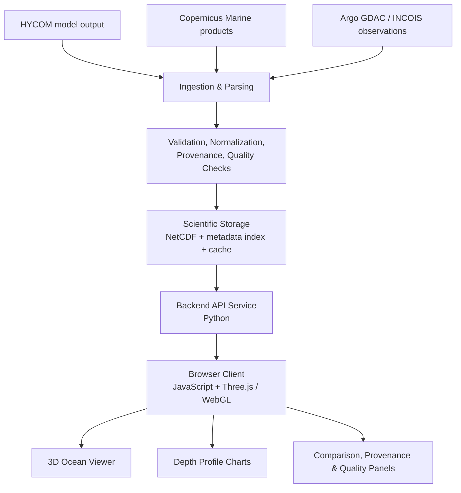

# BT-MANTHAN

# 🌊 SAGAR-DRISHTI
### Browser-Native 3D Ocean Data Visualization & Model–Observation Comparison Platform

**SIH Problem Statement 26067**
Integrating numerical ocean model outputs with in-situ observations in a single interactive 3D environment.

[**Live Demo**](https://sagar-drishti-production.up.railway.app) · [Documentation](./docs) · [Architecture](./docs/03-architecture.md)

---

## The Problem

India's Exclusive Economic Zone and coastline demand continuous, high-resolution monitoring of
ocean state variables. INCOIS generates and archives large volumes of ocean model output —
three-dimensional fields of temperature, salinity, currents and chlorophyll — alongside real-time
and delayed-mode observations from autonomous instruments such as Argo profiling floats and gliders.
These datasets live in NetCDF and ASCII formats across multiple depth levels, grids and time steps,
and **a web browser cannot read them directly**.

Existing tooling is desktop-bound, largely 2D, or splits model data and observation data across
separate applications. An operational forecaster correlating a model prediction with observational
evidence is forced to toggle between software packages, which slows the exact judgement calls that
hazard assessment, search-and-rescue support and fishery advisories depend on.

Sagar-Drishti closes that gap: **one browser-native environment where model fields and instrument
observations are co-visualized, matched and compared.**

## The Solution

A platform where a user selects a model source, variable, region, depth and time; explores the field
in interactive 3D; views Argo float positions and profiles; and runs a scientifically controlled
model–observation comparison with full provenance and quality records attached.

| Capability | Implementation |
|---|---|
| 3D volumetric rendering | Browser-native WebGL via Three.js — depth-band cross-sections, perspective camera, orbit controls |
| Model data sources | HYCOM and Copernicus Marine model products, ingested through xarray |
| Observation overlay | Argo profiling floats as geospatially accurate markers with drill-down profiles |
| Depth & time navigation | Depth slider with vertical interpolation, time-range selection, playback animation |
| Model–observation comparison | Matched comparison with eligibility checks and statistics (RMSE, bias, MAE) |
| Data provenance | Source, platform, variable, unit, timestamp, coordinates and processing trail per value |
| Data Quality Index | Transparent, rule-based quality assessment — no arbitrary reliability percentage |
| Raw vs assimilated | View A (raw model) / View B (EnOI-assimilated) toggle for state comparison |
| Extensibility | Common internal representation, so Glider / CTD / BGC / ADCP plug in without re-engineering |

## Architecture

Model and observation data never reach the browser as NetCDF. A Python backend performs
spatial, temporal and vertical subsetting and returns only web-ready JSON.

Full explanation: [docs/03-architecture.md](./docs/03-architecture.md)

## Technology Stack

| Layer | Technology |
|---|---|
| Scientific processing | Python, xarray, NumPy, Pandas |
| Backend service | Flask, REST endpoints, response caching |
| Frontend | Vanilla JavaScript (no framework), HTML5, CSS3 |
| 3D rendering | Three.js, WebGL |
| Charts | Chart.js |
| Deployment | Railway |
| Data formats | NetCDF, JSON, CSV, delimited text |

## Repository Layout

| Folder | File | Purpose |
|---|---|---|
| `backend/` | `Server.py` | Application server & API routes |
| `backend/` | `copernicus_model.py` | Copernicus Marine model data extraction |
| `backend/` | `Fetch_incois_argo.py` | Argo float observation retrieval |
| `backend/` | `parse_nc.py` | NetCDF parser and subsetting utilities |
| `frontend/` | `index.html` | Landing page |
| `frontend/` | `explorer.html` | 3D explorer, comparison & analysis interface |
| `docs/` | — | Problem, solution, architecture, pipeline, scientific method, DQI, phases, flowcharts |

## Running Locally

git clone [github.com](https://github.com/Khushi18-code/BT-MANTHAN.git)
cd BT-MANTHAN
pip install -r requirements.txt
python backend/Server.py

Open \`frontend/index.html\` — or the server root — in a browser.

## Project Status

Tracked honestly, because the phases are the interesting part.

| Phase | Scope | Status |
|---|---|---|
| **Phase 1 — Foundation** | Problem analysis, data format study, common data schema | ✅ Complete |
| **Phase 2 — Ingestion** | NetCDF parsing, Copernicus Marine extraction, INCOIS Argo retrieval | ✅ Complete |
| **Phase 3 — 3D Visualization** | Three.js viewer, cross-section rendering, depth and time controls, float markers | ✅ Complete |
| **Phase 4 — Comparison Layer** | Model–observation matching, vertical interpolation, difference statistics | 🔄 In progress |
| **Phase 5 — Quality & Provenance** | Data Quality Index methodology, provenance panel, quality flags | 🔄 In progress |
| **Phase 6 — EnOI Analysis** | Raw vs assimilated state workflow, validation metrics | 📋 Designed |
| **Phase 7 — Extensibility** | Glider, CTD, BGC, ADCP integration | 📋 Planned |

📄 Detailed phase breakdown with deliverables: [docs/07-project-phases.md](./docs/07-project-phases.md)

## Scientific Grounding

Three concepts stay deliberately separate, and the interface keeps them separate too:

- **Data Quality Index** — is this record structurally and plausibly usable? Answered by explicit
  checks: valid coordinates, timestamp and depth; required fields present; missing-value detection;
  duplicate detection; configured plausibility ranges; source QC flags where available.
- **Model–observation difference** — how far did a matched model value differ from the observation?
  A measurement of disagreement, not a statement about uncertainty.
- **Uncertainty** — how uncertain is an estimate, by an actual uncertainty method. Not inferred from
  a difference.

Read the full treatment: [docs/05-scientific-method.md](./docs/05-scientific-method.md) ·
[docs/06-dqi-framework.md](./docs/06-dqi-framework.md)

## Public Outreach

The same platform doubles as science communication. Numerical ocean model output is normally
inaccessible to non-specialists; rendered as an interactive 3D experience it becomes teachable.
The interface supports this with a learning mode offering plain-language explanations of each layer,
making it usable for school and college education, public awareness campaigns and e-learning.

## Future Scope

- Real-time scheduled ingestion from additional model and observation sources
- ML-derived ocean products integrated as first-class variables
- OGC WMS/WCS interoperability and CF-convention compliance for external portal integration
- Uncertainty quantification module built on an explicit method, feeding a documented error budget
- Multi-float and multi-observation comparison workspaces for regional validation studies

## Data Attribution

Oceanographic data used by this project is provided by third-party sources — INCOIS, Copernicus
Marine and the Argo programme. Such data remains subject to the respective provider's terms,
licenses and attribution requirements. This repository's own source code is released under the
MIT License.

**Team BT-MANTHAN** · SIH 2026 · Problem Statement 26067

