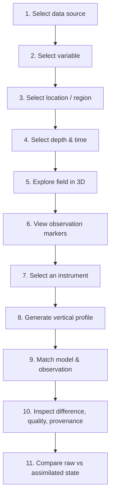

# Solution Overview

## Mental Model

Keep two ideas apart at all times:

- **MODEL** — what a numerical system estimates or simulates.
- **OBSERVATION** — what an instrument measured.

The platform visualizes both and compares them. It does not itself measure the ocean, and it never
presents a model-derived value as a measurement.

## Core User Workflow

## Functional Requirements and How They Are Met

### 1. 3D Volumetric Rendering
Interactive visualization of model fields across the full water column using Three.js and WebGL.
Depth-band cross-section rendering, orbit and perspective camera control, depth-slice navigation,
vertical exaggeration for depth perception, and time-step playback.

### 2. Instrument Data Overlay
Argo floats displayed as geospatially accurate markers within the 3D field. Selecting a float opens
its depth-versus-variable profile with timestamps, alongside the model value at matching location,
depth and time.

### 3. Multi-Format Data Ingestion
Automated parsers for NetCDF via xarray, plus delimited text handling. A common internal
representation lets new variables or sources be added with minimal change — a new parser maps into
the same schema rather than altering the pipeline.

### 4. Customizable Colorbars and Variable Controls
Variable selector, dynamic colorbar configuration with adjustable range and scale, layer opacity
control, and a vertical exaggeration slider.

### 5. Web-Based Scalable Architecture
Browser client with no client-side installation, served by a lightweight REST backend. The backend
subsets requested variables by region, depth and time, so full-resolution datasets never cross the
network to the browser.

### 6. Extensible Design
A plugin-style module structure for additional sensors (CTD, moorings, HF-radar, ADCP), additional
model variables, and ML-derived products. Argo is the first implementation; the extensibility layer
is the point.

## Interface Structure

| Region | Contents |
|---|---|
| Left control panel | Data source, variable, time range, depth, region/location, observation type, layer toggles |
| Main view | 3D ocean field with model data and observation markers, synced with the map |
| Profile / comparison panel | Depth-versus-variable chart — model, observation, difference, statistics |
| Information panel | Provenance, quality status, matching and interpolation details |
| State control | View A (raw model) ↔ View B (assimilated) |

The three views stay synchronized: selecting an observation updates the profile and comparison;
changing depth or position updates the visualization context.
