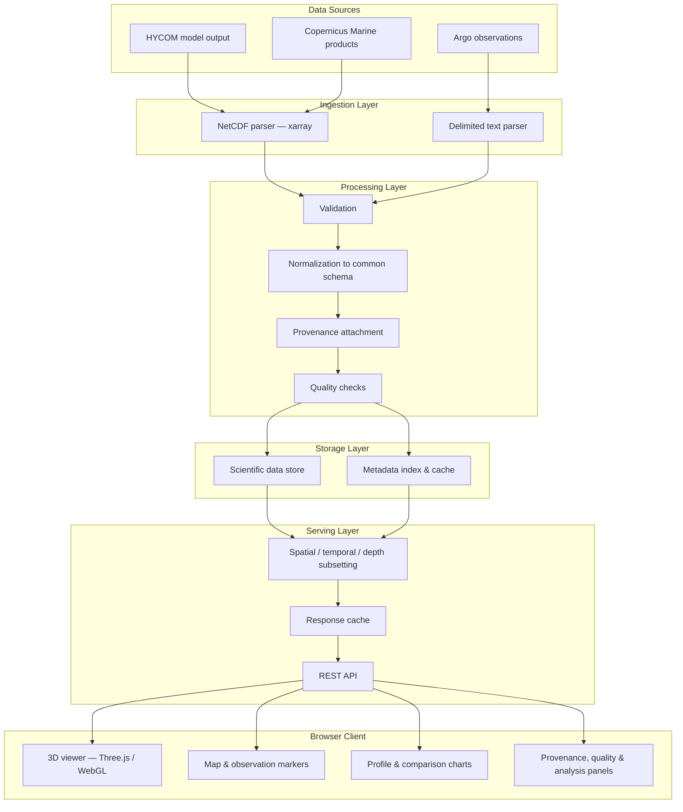
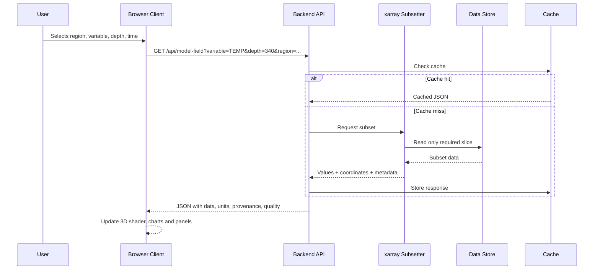

# Technical Architecture

## Layer Diagram

## Why a Backend Is Necessary

Massive ocean datasets are stored as NetCDF — a binary scientific container format. A browser cannot
read it. Beyond format, there is scale: a single model field spans many depth levels, a wide grid and
many time steps, and the full dataset runs to gigabytes.

The backend is the translator and the subsetter. It opens the dataset with xarray, extracts exactly
the requested variable, region, depth window and time window — without materializing the whole file —
and returns web-ready JSON sized for the browser.

**Rule: never send giant NetCDF files to the browser.**

## Request Path

Caching matters beyond speed: repeated requests for the same region and depth combination should not
repeatedly load the upstream infrastructure.

## Subsystem Responsibilities

| Subsystem | Responsibility |
|---|---|
| Ingestion | Parse NetCDF and delimited text into a common internal representation |
| Validation | Reject or flag records failing structural and plausibility checks |
| Normalization | Unify variable names, units, coordinate and time conventions across sources |
| Provenance | Attach source, platform, processing and retrieval metadata to every returned value |
| Storage | Hold scientific data and a metadata/index layer for fast lookup |
| Serving | Expose REST endpoints with subsetting and caching |
| Client | Render 3D field, markers, profiles, comparison and analysis in the browser |

## Source-Specific Handling

HYCOM and Copernicus Marine do not share identical schemas, coordinates, units, metadata or
time/depth conventions. The ingestion layer treats each source explicitly rather than assuming
structural equivalence — a shared interface, separate adapters.

## Deployment

Static frontend and Python backend deployed together via Render. The browser client carries no
client-side dependencies beyond the served assets, so deployment on institutional infrastructure
requires no end-user installation.
