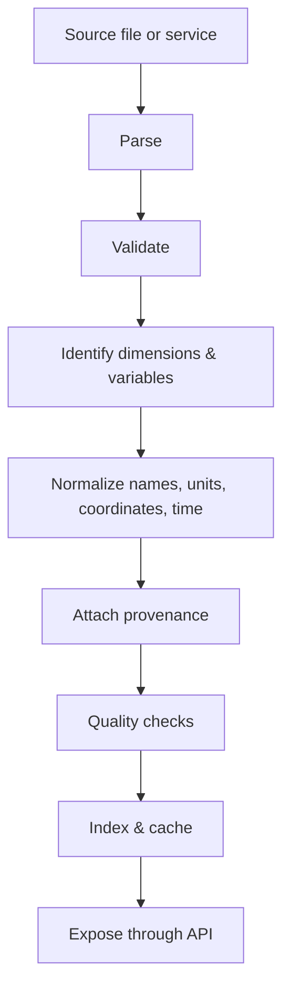
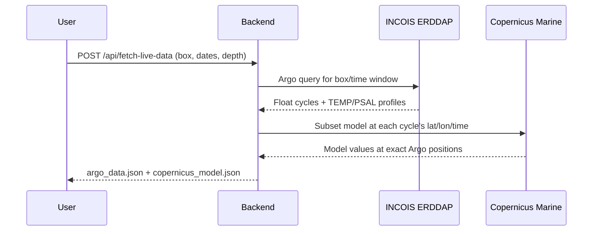

# Data Ingestion & Normalization

## Pipeline

## Two-Step Sequential Fetch

## What Normalization Means Here

Normalization converts different source structures into **one common internal representation**. It
does not mean database normalization.

### Common Model Record

| Field | Description |
|---|---|
| variable | Canonical name, e.g. `temperature` |
| unit | Canonical unit, e.g. `degrees_Celsius` |
| timestamp | ISO 8601 UTC |
| depth | Metres, positive down |
| latitude / longitude | Decimal degrees, WGS84 |
| value | Numeric field value |
| levels | Source model levels used |
| method | Interpolation or extraction method applied |
| provenance | Source, dataset, run identifier, retrieval time |
| quality | Check results and source flags |

### Common Observation Record

| Field | Description |
|---|---|
| variable | Canonical name |
| unit | Canonical unit |
| timestamp | Observation time, ISO 8601 UTC |
| depth | Measurement depth, metres |
| latitude / longitude | Position at observation |
| value | Measured value |
| platform | Instrument class and identifier |
| provenance | Provider, file, retrieval time |
| quality | QC flags and validation results |

Model and observation records share this shape deliberately: it is what allows a new instrument to be
added without rewriting the comparison layer.

## NetCDF, Plainly

NetCDF is a scientific container format for multidimensional data. A typical ocean dataset
conceptually holds `temperature[time][depth][latitude][longitude]` along with units, coordinate
arrays, timestamps and metadata.

**NetCDF is not the ocean model.** HYCOM and other numerical systems produce model output; NetCDF is
one way that output is stored and exchanged.

## Handling Scale

Full ocean datasets are gigabytes. A user needs a small window. The ingestion and serving layers
therefore subset on four axes before anything crosses the network:

1. **Variable** — one variable per request
2. **Spatial** — bounding box
3. **Vertical** — depth range
4. **Temporal** — date range

## Edge Cases Handled

- Missing values and fill values
- Mismatched units between sources
- Absent depth coordinates
- Duplicate observation records
- Large files requiring chunked reading
- Time gaps between model steps and observation times
