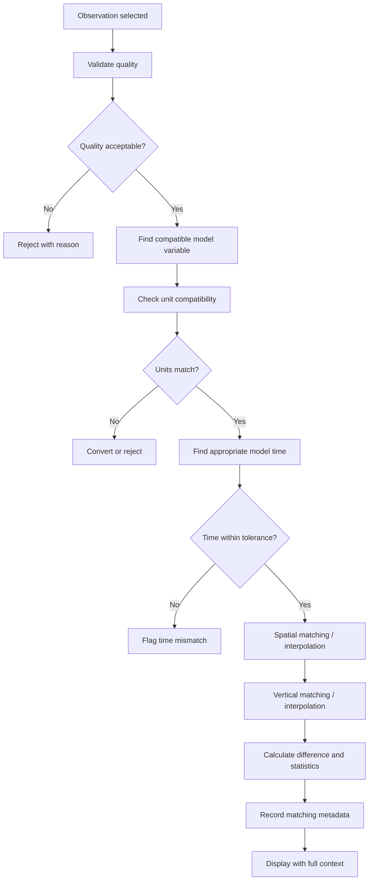
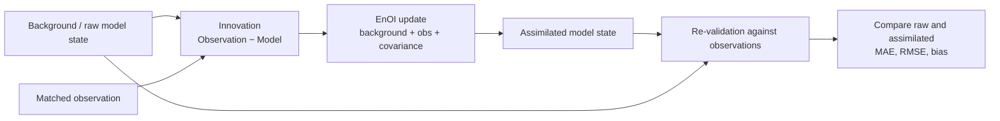

# Scientific Comparison Method

## Why Matching Is Not Trivial

A model grid does not contain the exact observation location, time or depth. Comparing a model value
with an observation without handling that mismatch produces a number that looks scientific and means
nothing.

## Comparison Sequence

## Eligibility Checks

A comparison is only displayed when all of the following hold:

1. The observation passed its quality checks.
2. A model variable equivalent to the observed variable exists.
3. Units are compatible — converted explicitly if convertible, rejected if not.
4. A model time step exists within an acceptable tolerance.
5. Horizontal position can be resolved, by grid cell or interpolation.
6. Depth can be resolved, by model level or vertical interpolation.

## Matching Metadata

Every comparison exposes enough information for the user to judge it:

- Time difference between observation and matched model step
- Spatial distance from the model grid point, or the matching method used
- Original model levels involved
- Interpolation method applied, flagged explicitly as interpolated
- Units of both values
- Quality status of the observation

## Statistics

Where scientifically appropriate, the comparison reports:

| Metric | Meaning |
|---|---|
| Difference (Model − Observation) | Signed gap for a single matched pair |
| Bias | Mean signed difference across a set |
| MAE | Mean absolute difference |
| RMSE | Root mean square difference, weighted toward larger gaps |
| Correlation | Co-variation between matched model and observation series |

Sign convention is declared explicitly wherever a difference is shown, because `Model − Observation`
and `Observation − Model` tell opposite stories about the same pair.

## Concepts That Stay Separate

| Concept | Question it answers | Example |
|---|---|---|
| Data Quality | Is this record structurally and plausibly usable? | Missing depth; invalid coordinate; duplicate record |
| Model–observation difference | How far did the matched model value differ from the observation? | Model 25.8 °C against Argo 26.4 °C gives −0.6 °C |
| Uncertainty | How uncertain is an estimate, by an actual uncertainty method? | A justified uncertainty interval |

A difference is **not** an uncertainty. A quality flag is **not** an accuracy score.

## Displaying Differences

- Diverging colour scale centred on zero, so sign is readable at a glance
- Legend with units on the map and on the vertical profile
- Difference never shown without its matching metadata attached
- Units shown for both the model value and the observation

## Raw Model and Assimilated State

| Term | Meaning |
|---|---|
| Raw model state | The selected model field before any assimilation update |
| Observation | A matched Argo or other supported observation |
| Innovation | Observation minus matched model value, under the declared sign convention |
| EnOI | Ensemble Optimal Interpolation — updates a background state using observations and covariance information |
| Assimilated state | The updated model estimate produced by the EnOI workflow |
| Validation | Comparing raw and assimilated states against observations using appropriate metrics |

**EnOI does not automatically prove improvement.** Any claim that assimilation improves accuracy must
be supported by measured validation results, reported with the metric used, the sample it was
computed over, and the period it covers. The platform presents raw and assimilated states side by
side so the user can inspect the change — the metric decides whether it is an improvement, not the
interface.
