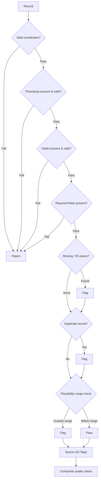

# Data Quality Framework

## Purpose

The Data Quality Index answers a narrow, answerable question: **is this record structurally and
plausibly usable?** It is a transparent, rule-based assessment — not an unexplained reliability
percentage, and not a measure of how close a value is to truth.

## Checks

## Check Definitions

| Check | Rule | Failure outcome |
|---|---|---|
| Coordinate validity | Latitude within ±90, longitude within ±180, both non-null | Reject |
| Timestamp validity | Present, parseable, within dataset coverage | Reject |
| Depth validity | Present, non-negative, within configured maximum | Reject |
| Required fields | Variable and value present and non-null | Reject |
| Missing values | Value not equal to a declared fill value | Flag |
| Duplicates | No repeated platform + timestamp + depth triple | Flag |
| Plausibility range | Value within physically configured range for the variable | Flag |
| Source QC flags | Provider quality flag inspected and recorded | Propagate |

## Status Levels

| Level | Meaning |
|---|---|
| **Pass** | All checks satisfied |
| **Flagged** | Structurally usable, with one or more concerns recorded and named |
| **Reject** | Fails a structural check; excluded from comparison |

## If a Numeric Index Is Used

A numeric DQI may be computed, but only with its formula and weighting published alongside it — the
component checks, their weights, and how flagged conditions combine. An arbitrary figure such as
"87% reliable" is not acceptable and will not be presented.

## Separation of Concerns

Quality assessment is deliberately kept away from accuracy assessment:

- Quality says whether a record is usable.
- Comparison statistics say how model and observation differ.
- Uncertainty says how uncertain an estimate is, by an actual uncertainty method.

Conflating these produces a number nobody can interpret.
