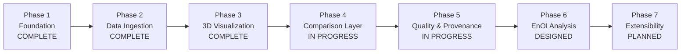

# Project Phases

## Phase Map

---

## Phase 1 — Foundation ✅ Complete

**Goal:** understand the data problem before writing visualization code.

Deliverables:
- Problem statement analysis and gap identification
- Study of NetCDF structure, CF conventions and coordinate systems
- Survey of model sources (HYCOM, Copernicus Marine) and observation sources (Argo)
- Definition of the common internal data schema for model and observation records
- Technology selection: Python + xarray backend, vanilla JavaScript + Three.js frontend

**Exit criteria met:** a documented schema both model and observation data can map into.

---

## Phase 2 — Data Ingestion ✅ Complete

**Goal:** get real data out of scientific formats and into the platform.

Deliverables:
- NetCDF parser built on xarray (`parse_nc.py`)
- Copernicus Marine model data extraction pipeline (`copernicus_model.py`)
- Argo observation retrieval from INCOIS (`Fetch_incois_argo.py`)
- Unit, coordinate and time normalization into the common schema
- Metadata extraction and provenance capture

**Exit criteria met:** real model and observation data flow into the platform from source files.

---

## Phase 3 — 3D Visualization ✅ Complete

**Goal:** render ocean fields in the browser, natively.

Deliverables:
- Three.js / WebGL 3D viewer with orbit and perspective camera control (`explorer.html`)
- Depth-band cross-section rendering of gridded temperature, salinity and chlorophyll fields
- Geospatially accurate observation markers within the 3D field
- Depth slider, time range selection and playback controls
- Vertical exaggeration and layer opacity controls

**Exit criteria met:** a user can select a region, variable, depth and time and explore the field in 3D.

---

## Phase 4 — Comparison Layer 🔄 In Progress

**Goal:** make a scientifically valid model–observation comparison possible.

Deliverables:
- Model–observation matching across space, time and depth
- Comparison eligibility checks before any comparison is displayed
- Vertical interpolation with an explicit interpolation indicator
- Difference statistics: bias, MAE, RMSE, correlation
- Matching metadata surfaced with every comparison

**Remaining work:** validation of interpolation behaviour across depth ranges and time tolerances;
edge-case testing on mismatched units and missing depth.

---

## Phase 5 — Quality & Provenance 🔄 In Progress

**Goal:** every value on screen can be traced and judged.

Deliverables:
- Data Quality Index checks implemented for model and observation records
- Provenance panel exposing source, platform, variable, unit, timestamp, coordinates and processing trail
- Source QC flag propagation into the interface
- Quality status displayed alongside every comparison

**Remaining work:** publication of the DQI component weights; expanding plausibility ranges across all
supported variables.

---

## Phase 6 — Raw vs Assimilated EnOI Analysis 📋 Designed

**Goal:** let a user inspect how the model state changes when observations are incorporated.

Deliverables:
- EnOI update workflow: background state plus matched observations plus covariance information
- View A (raw model) ↔ View B (assimilated) toggle
- Raw and assimilated 3D field inspection
- Profile comparison against observations for both states
- Validation metrics comparing raw and assimilated states against observations

**Open work:** covariance construction and its documentation; validation design so any improvement
claim rests on measured results rather than assumption.

---

## Phase 7 — Extensibility 📋 Planned

**Goal:** new instruments and variables, without re-engineering.

Targets, in order:

| Priority | Instrument | Visualization |
|---|---|---|
| 1 | Glider | Track + depth path + profiles + comparison |
| 2 | CTD | Station marker + vertical profile |
| 3 | BGC | Profile + variable-specific comparison |
| 4 | ADCP | Current vectors / profile + model current comparison |

All four map onto the common observation representation defined in Phase 1 — that is what makes them
extensions rather than rewrites.

---

## Summary

| Phase | Scope | Status |
|---|---|---|
| 1 | Foundation, schema, technology selection | ✅ Complete |
| 2 | NetCDF and observation ingestion | ✅ Complete |
| 3 | Browser-native 3D visualization | ✅ Complete |
| 4 | Model–observation comparison | 🔄 In progress |
| 5 | Quality index and provenance | 🔄 In progress |
| 6 | Raw vs assimilated EnOI analysis | 📋 Designed |
| 7 | Glider, CTD, BGC, ADCP support | 📋 Planned |
