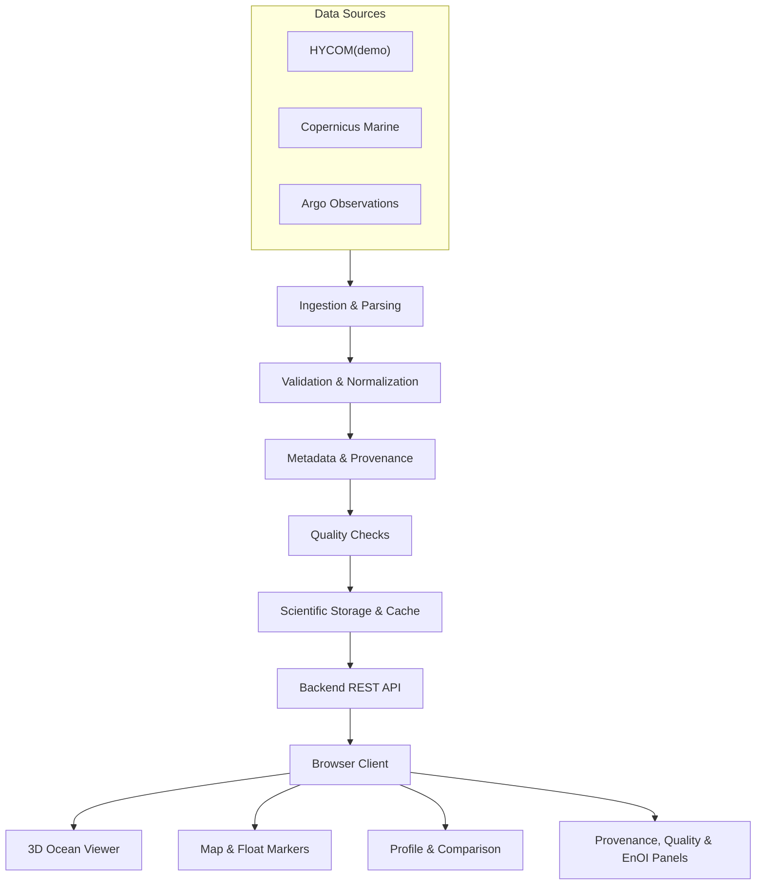

```mermaid
flowchart TD
    subgraph SRC[Data Sources]
        A1["HYCOM(demo)"]
        A2[Copernicus Marine]
        A3[Argo Observations]
    end
    SRC --> ING[Ingestion & Parsing]
    ING --> VAL[Validation & Normalization]
    VAL --> PRO[Metadata & Provenance]
    PRO --> QC[Quality Checks]
    QC --> STO[Scientific Storage & Cache]
    STO --> API[Backend REST API]
    API --> WEB[Browser Client]
    WEB --> V1[3D Ocean Viewer]
    WEB --> V2[Map & Float Markers]
    WEB --> V3[Profile & Comparison]
    WEB --> V4[Provenance, Quality & EnOI Panels]
```
