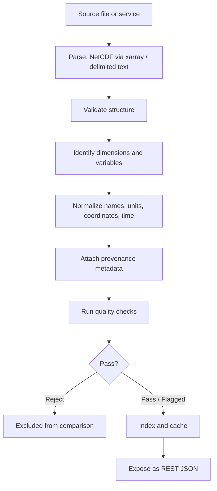

```mermaid
flowchart TD
    A[Source file or service] --> B[Parse: NetCDF via xarray / delimited text]
    B --> C[Validate structure]
    C --> D[Identify dimensions and variables]
    D --> E[Normalize names, units, coordinates, time]
    E --> F[Attach provenance metadata]
    F --> G[Run quality checks]
    G --> H{Pass?}
    H -->|Reject| X[Excluded from comparison]
    H -->|Pass / Flagged| I[Index and cache]
    I --> J[Expose as REST JSON]
```
