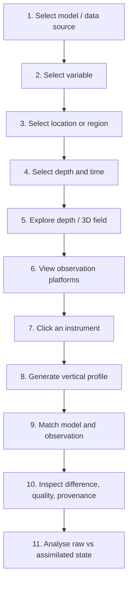

```mermaid
flowchart TD
    A[1. Select model / data source] --> B[2. Select variable]
    B --> C[3. Select location or region]
    C --> D[4. Select depth and time]
    D --> E[5. Explore depth / 3D field]
    E --> F[6. View observation platforms]
    F --> G[7. Click an instrument]
    G --> H[8. Generate vertical profile]
    H --> I[9. Match model and observation]
    I --> J[10. Inspect difference, quality, provenance]
    J --> K[11. Analyse raw vs assimilated state]
```
