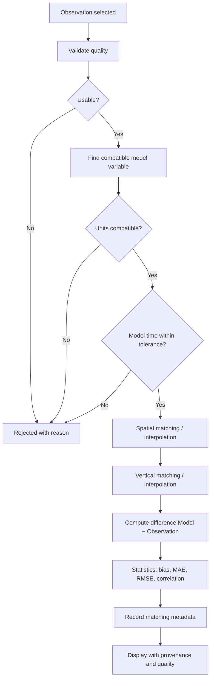

```mermaid
flowchart TD
    A[Observation selected] --> B[Validate quality]
    B --> C{Usable?}
    C -->|No| R[Rejected with reason]
    C -->|Yes| D[Find compatible model variable]
    D --> E{Units compatible?}
    E -->|No| R
    E -->|Yes| F{Model time within tolerance?}
    F -->|No| R
    F -->|Yes| G[Spatial matching / interpolation]
    G --> H[Vertical matching / interpolation]
    H --> I[Compute difference Model − Observation]
    I --> J[Statistics: bias, MAE, RMSE, correlation]
    J --> K[Record matching metadata]
    K --> L[Display with provenance and quality]
```
