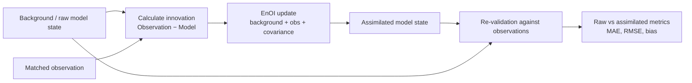

```mermaid
flowchart LR
    A[Background / raw model state] --> C[Calculate innovation\nObservation − Model]
    B[Matched observation] --> C
    C --> D[EnOI update\nbackground + obs + covariance]
    D --> E[Assimilated model state]
    E --> F[Re-validation against observations]
    A --> F
    F --> G[Raw vs assimilated metrics\nMAE, RMSE, bias]
```
